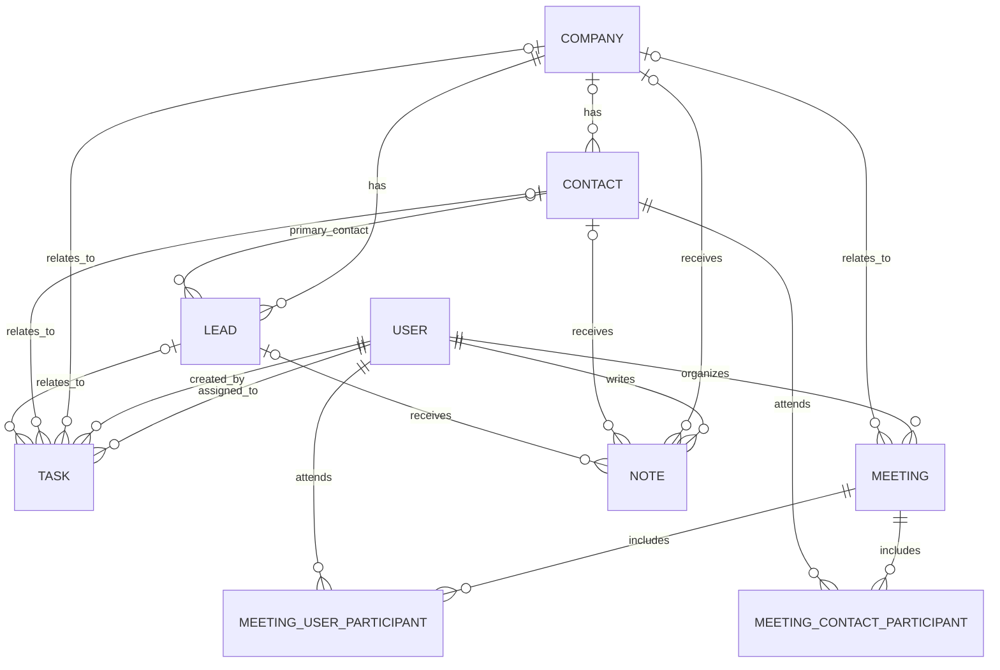

# Mini CRM Database Design

## Company and Contact Relationship

A company can have many contacts.

A contact can belong to zero or one company.

### Relationship

- Type: one-to-many
- Parent entity: Company
- Child entity: Contact
- Foreign key: `contacts.company_id`
- References: `companies.id`
- Nullable: Yes

Allowing `company_id` to be null means a contact can exist before being linked to a company.

The database must reject a `company_id` that does not reference an existing company.

## Company Entity

A company must have a name. Other business information can be added later.

### User-entered fields

| Field | Required | Description |
|---|---|---|
| `name` | Yes | Company name |
| `industry` | No | Type of business |
| `website` | No | Company website |
| `email` | No | General company email |
| `phone` | No | General phone number |
| `address` | No | Business address |

### Automatically managed fields

| Field | Description |
|---|---|
| `id` | Unique identifier generated by the application |
| `created_at` | Date and time the company was created |
| `updated_at` | Date and time the company was last updated |

## Contact Entity

A contact must have a first name. Other details can be added later.

### User-entered fields

| Field | Required | Description |
|---|---|---|
| `first_name` | Yes | Contact's first name |
| `last_name` | No | Contact's last name |
| `email` | No | Contact's email address |
| `phone` | No | Contact's phone number |
| `job_title` | No | Contact's position at a company |
| `company_id` | No | Company linked to the contact |

### Automatically managed fields

| Field | Description |
|---|---|
| `id` | Unique identifier generated by the application |
| `created_at` | Date and time the contact was created |
| `updated_at` | Date and time the contact was last updated |

### Company relationship

`contacts.company_id` references `companies.id`.

Multiple contacts may have the same `company_id`, which creates the one-to-many relationship.

If `company_id` is `NULL`, the contact is not currently linked to a company.

## Lead Entity

A lead represents a possible sale or business opportunity.

A lead must belong to a company and may optionally identify a primary contact.

### User-entered fields

| Field | Required | Description |
|---|---|---|
| `title` | Yes | Name of the sales opportunity |
| `company_id` | Yes | Company associated with the lead |
| `contact_id` | No | Primary contact for the opportunity |
| `stage` | Yes | Current pipeline stage; defaults to `New` |
| `estimated_value` | No | Possible monetary value of the lead |
| `source` | No | Where the lead came from |
| `expected_close_date` | No | Estimated completion date |
| `description` | No | Additional information |

### Automatically managed fields

| Field | Description |
|---|---|
| `id` | Unique identifier |
| `created_at` | Date and time the lead was created |
| `updated_at` | Date and time the lead was last updated |

### Relationships

`leads.company_id` references `companies.id`.

`leads.contact_id` references `contacts.id`.

If a primary contact is selected, that contact must belong to the same company as the lead.

### Pipeline stages

Allowed stages are:

1. `New`
2. `Contacted`
3. `Qualified`
4. `Won`
5. `Lost`

`Won` and `Lost` are closed stages.

The estimated value cannot be negative.

## User Entity

A user is an authorized person who can sign in to the CRM.

### User-entered fields

| Field | Required | Description |
|---|---|---|
| `full_name` | Yes | User's display name |
| `email` | Yes | Unique email used to sign in |
| `password` | Yes | Accepted by the API but never stored directly |

### Stored fields

| Field | Description |
|---|---|
| `id` | Unique user identifier |
| `full_name` | User's display name |
| `email` | Normalized lowercase email |
| `password_hash` | Secure one-way hash of the password |
| `is_active` | Whether the account may sign in |
| `created_at` | Date and time the user was created |
| `updated_at` | Date and time the user was last updated |

### Rules

- Every email must be unique.
- Emails are stored in lowercase.
- Plain-text passwords must never be stored or logged.
- `is_active` defaults to `true`.
- Roles and permissions are not part of the core version.
## Task Entity

A task represents work assigned to a CRM user.

### Fields

| Field | Required | Description |
|---|---|---|
| `id` | Automatic | Unique task identifier |
| `title` | Yes | Short description of the work |
| `description` | No | Additional instructions |
| `status` | Yes | Defaults to `Pending` |
| `priority` | Yes | Defaults to `Medium` |
| `due_at` | No | Due date and time |
| `assigned_to_id` | Yes | User responsible for the task |
| `created_by_id` | Automatic | User who created the task |
| `company_id` | No | Related company |
| `contact_id` | No | Related contact |
| `lead_id` | No | Related lead |
| `completed_at` | No | Date and time the task was completed |
| `created_at` | Automatic | Date and time the task was created |
| `updated_at` | Automatic | Date and time the task was last updated |

### Statuses

- `Pending`
- `In Progress`
- `Completed`

### Priorities

- `Low`
- `Medium`
- `High`

### Relationships

- `tasks.assigned_to_id` references `users.id`.
- `tasks.created_by_id` references `users.id`.
- `tasks.company_id` references `companies.id`.
- `tasks.contact_id` references `contacts.id`.
- `tasks.lead_id` references `leads.id`.

### Rules

- At most one of `company_id`, `contact_id`, or `lead_id` may be set.
- All three may be `NULL` for a general task.
- `completed_at` is set when status changes to `Completed`.
- `completed_at` is cleared if a completed task is reopened.
## Meeting Entity

A meeting represents a scheduled interaction with client contacts and CRM users.

### Fields

| Field | Required | Description |
|---|---|---|
| `id` | Automatic | Unique meeting identifier |
| `title` | Yes | Meeting subject |
| `description` | No | Meeting purpose or agenda |
| `starts_at` | Yes | Starting date and time |
| `ends_at` | Yes | Ending date and time |
| `location` | No | Physical meeting location |
| `meeting_link` | No | Online meeting URL |
| `notes` | No | Meeting-specific notes |
| `status` | Yes | Defaults to `Scheduled` |
| `organizer_id` | Yes | User responsible for the meeting |
| `company_id` | No | Company associated with the meeting |
| `created_at` | Automatic | Date and time the meeting was created |
| `updated_at` | Automatic | Date and time the meeting was updated |

### Statuses

- `Scheduled`
- `Completed`
- `Cancelled`

### User participants

The `meeting_user_participants` join table contains:

| Field | Description |
|---|---|
| `meeting_id` | References `meetings.id` |
| `user_id` | References `users.id` |

### Contact participants

The `meeting_contact_participants` join table contains:

| Field | Description |
|---|---|
| `meeting_id` | References `meetings.id` |
| `contact_id` | References `contacts.id` |

### Rules

- `ends_at` must be later than `starts_at`.
- Dates and times are stored in UTC.
- The application displays dates in the user's local timezone.
- The same user cannot be added to a meeting twice.
- The same contact cannot be added to a meeting twice.
- `meetings.organizer_id` references `users.id`.
- `meetings.company_id` references `companies.id`.

## Note Entity

A note stores written information related to a company, contact, or lead.

### Fields

| Field | Required | Description |
|---|---|---|
| `id` | Automatic | Unique note identifier |
| `body` | Yes | Note content |
| `author_id` | Automatic | User who created the note |
| `company_id` | Conditional | Related company |
| `contact_id` | Conditional | Related contact |
| `lead_id` | Conditional | Related lead |
| `created_at` | Automatic | Date and time the note was created |
| `updated_at` | Automatic | Date and time the note was updated |

### Relationships

- `notes.author_id` references `users.id`.
- `notes.company_id` references `companies.id`.
- `notes.contact_id` references `contacts.id`.
- `notes.lead_id` references `leads.id`.

### Rules

- The note body cannot be empty.
- Exactly one of `company_id`, `contact_id`, or `lead_id` must be set.
- The authenticated user automatically becomes the author.
- All authenticated CRM users may read notes.
- Only the note author may edit or delete their note.
## Complete Relationship Diagram

